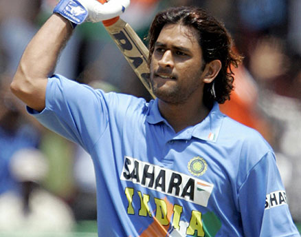

I have been thinking for a while to start a personal website where I can host my projects and share my thoughts. I was looking for more of a hybrid version where I can do both.

If you've just landed here, let me give a small introduction about myself.

My name is Sameer and I am currently pursuing B.Tech (in ECE) from NIT Sikkim and the worst thing about this is that I am graduating this summer.

In a 4 year course, I spent only 2.5 years in college and it seems that the remaining few months will also be spent at home due to my college not opening even though the government has allowed them to do so.

I have been watching sports for over a decade now. I live in India, and here cricket is the de-facto national sport and I have closely following our national cricket team for the last 16 years. 

>It started with watching a guy with big hairs scoring an unbeaten 183 against Sri Lanka in Jaipur. That day (in 2005), I became an MS Dhoni fan. I was just 7 years old.

Though, I became a little disconnected after the world cup semi-final loss against NZ. Everyone was asking me why isn't Dhoni playing and hasn't been dropped from the team. Deep down, I knew that it would be his last match and I reciprocated the same.

Other than being a de-facto cricket fan, I am a huge **Manchester United** fan(a.k.a The Red Devils). **If you cut my veins, it'll bleed red (I know that was a bad joke, but, it's true)**. I have been following football for about 5 years now and have been closely following United for the last 2 years.

I hope to see you around :)